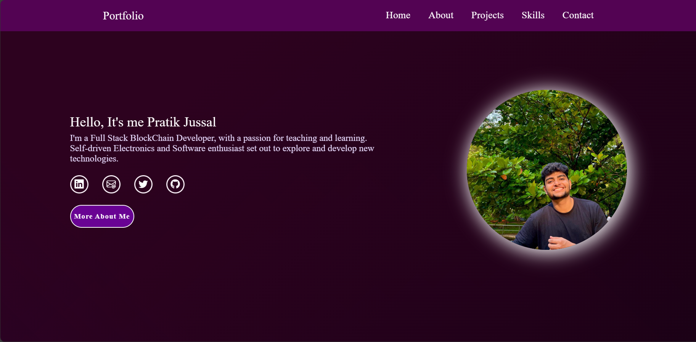

# Portfolio Website

# Overview
This is the repository for my personal portfolio website. The website is built using HTML, CSS, and JavaScript to showcase my projects, skills, and provide information about me.

# Features
  - Home Section: A brief introduction and welcome message.
  - About Me section: An overview of my background, education, skills, and experience.
  - Projects Section: Displays a selection of my notable projects with links to their respective repositories or live demos.
  - Skills Section: Highlights my technical skills and expertise.
  - Contact Section: Includes ways to get in touch with me, such as email or social media links.
  - Responsive Design: Ensures a seamless experience across various devices.

# How to Use
1) Clone the repository: `git clone https://github.com/your-username/your-portfolio.git`
2) Open index.html in your preferred web browser.
3) Feel free to customize as per your preference.

# Technologies Used
  - HTML
  - CSS
  - Javascript

# Author
Pratik Jussal